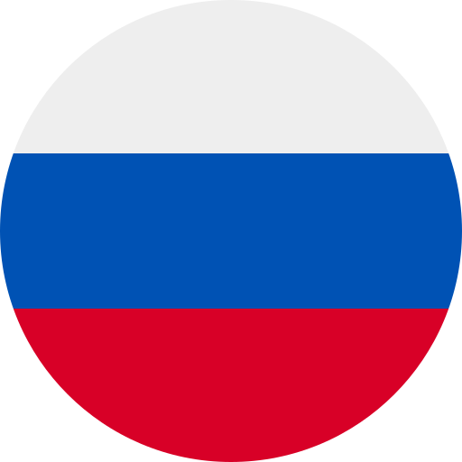
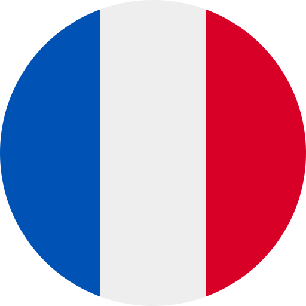

  <a href="../../../README.md">&nbsp;English</a>
  ·
  <a href="../ru/README.md">&nbsp;Русский</a>
  ·
  <a href="../zh-CN/README.md">&nbsp;中文</a>
  ·
  &nbsp;<b>Español</b>
  ·
  <a href="../hi/README.md">&nbsp;हिन्दी</a>
  ·
  <a href="../ar/README.md">&nbsp;العربية</a>
  ·
  <a href="../pt-BR/README.md">&nbsp;Português</a>
  ·
  <a href="../fr/README.md">&nbsp;Français</a>
  ·
  <a href="../de/README.md">&nbsp;Deutsch</a>
  ·
  <a href="../ja/README.md">&nbsp;日本語</a>
  ·
  <a href="../ko/README.md">&nbsp;한국어</a>

  

<h1 align="center">Hola, soy Damir 👋</h1>

  <b>Sistemas embebidos fiables, modulares y de misión crítica en C++ moderno y RTOS.</b>

  
  
  
  
  

Diseño desde cero sistemas embebidos independientes del hardware — y los demuestro con tests.

---

## 🌌 Ad astra

Mi objetivo es simple: **quiero trabajar en cosas que van al espacio.** Hoy son aviones RC y autopilotos para UAV; el rumbo es el sector aeroespacial: software de vuelo que tiene que funcionar a la primera, sin nadie cerca que pueda pulsar reset.

El espacio no pertenece a un solo país, así que este perfil tampoco habla un solo idioma: elige el tuyo arriba.

---

## 🧭 Cómo construyo

| | |
|---|---|
| 🧱 **Independiente del hardware** | Una HAL fina es la única capa que conoce el MCU. Los drivers no saben en qué bus están. |
| 🛡️ **Primero la tolerancia a fallos** | El comportamiento ante fallos y las máquinas de estados se diseñan antes que las funciones, no después. |
| ⏱️ **Determinista** | Bucles de control a frecuencia fija, sin memoria dinámica donde importa. |
| 🧪 **Demostrado, no prometido** | Compilaciones en host, simulación en lazo cerrado, cobertura, análisis estático y CI en cada cambio. |
| 🤝 **IA como ayuda, el control es mío** | La IA me hace más rápido; la arquitectura y la verificación siguen en mis manos. |

---

## 🚀 Proyecto principal — [OpenPlane](https://github.com/damir-lebedev/OpenPlaneProject)

Un controlador de vuelo y autopiloto de código abierto para aviones RC. El mismo firmware funciona en **ESP32-S3** y **STM32H743**.

| | |
|---|---|
| ✈️ **Autopiloto** | 12 modos de vuelo: estabilizado, mantener altitud, crucero, loiter, regreso a casa, despegue y aterrizaje automáticos, vuelo térmico, rescate |
| 🛡️ **Failsafe** | Orden de prioridad estricto (pérdida de enlace > ARM > modo > gas): ningún modo puede subir el gas por encima de ARM; si la radio se queda en silencio, el avión vuelve solo a casa |
| 🧱 **Arquitectura** | C++ header-only, la HAL es la única capa que conoce el MCU, drivers de sensores independientes de I2C/SPI, sin memoria dinámica en el bucle de control |
| ⏱️ **Tiempo real** | Bucle de control a 500 Hz, tareas en doble núcleo en ESP32, FreeRTOS en STM32 |
| 📡 **Telemetría** | Panel web a bordo, MAVLink hacia QGroundControl / Mission Planner (tramas verificadas byte a byte con `pymavlink`) |
| 📼 **Caja negra** | Cada vuelo se graba a 500 Hz: en la flash interna (ESP32-S3) o en una tarjeta SD (STM32) y se decodifica a CSV con una herramienta Python |
| 🧪 **Verificación** | 387 tests automáticos, 98 % de cobertura de líneas, simulaciones de vuelo en lazo cerrado de cada modo, 24 compilaciones placa × sensor sin ninguna advertencia |

   
  Radio apagada: el avión vuelve solo a casa. Simulación en lazo cerrado del firmware real.

### 📍 Dónde está realmente

| | |
|---|---|
| ✈️ **Primer prototipo, modo manual** | Voló |
| 🧪 **Autopiloto** | Verificado en banco, en tests y en simulación — a la espera de pruebas en vuelo |
| 🔌 **Placa STM32H743** | Ya [se controla desde un transmisor](https://t.me/lisnmylife/420) (iBUS, ARM, servos y motor) — los sensores vienen después |

Mantengo la tabla de estado del README de OpenPlane honesta a propósito: lo que voló, lo que funcionó en banco y lo que solo está probado.

También: [esp32-rc-joystick](https://github.com/damir-lebedev/esp32-rc-joystick) — un FlySky FS-i6 como joystick USB para simuladores de vuelo.

---

## 🛠️ Stack tecnológico

| | |
|---|---|
| **Lenguajes** | C++ (estándares modernos, POO), C, Python (herramientas, automatización) |
| **MCU** | ESP32 (S3, C3, clásico), STM32H743 |
| **RTOS y frameworks** | FreeRTOS, Arduino framework, STM32duino, PlatformIO |
| **Arquitectura** | SOLID, inyección de dependencias, HAL, diseño orientado a eventos, máquinas de estados a prueba de fallos |
| **Interfaces** | I2C, SPI, UART, SDMMC, iBUS, UBX (GPS), MAVLink |
| **Calidad** | Unity, compilaciones de test nativas (host), gcovr, cppcheck, clang-tidy, GitHub Actions |
| **Herramientas** | Git, Linux, telemetría Wi-Fi / HTTP, KiCad |

---

## 💼 Busco

**Embedded Firmware Engineer de nivel medio / Junior+ sólido** o **Software Architect** — puestos remotos en cualquier parte del mundo: robótica, UAV, aeroespacial y sistemas espaciales, IoT, hardware de alta carga.

📧 **dam.lebedev2018@yandex.ru** · 🐙 [OpenPlane en GitHub](https://github.com/damir-lebedev/OpenPlaneProject)

Per aspera ad astra ✦

